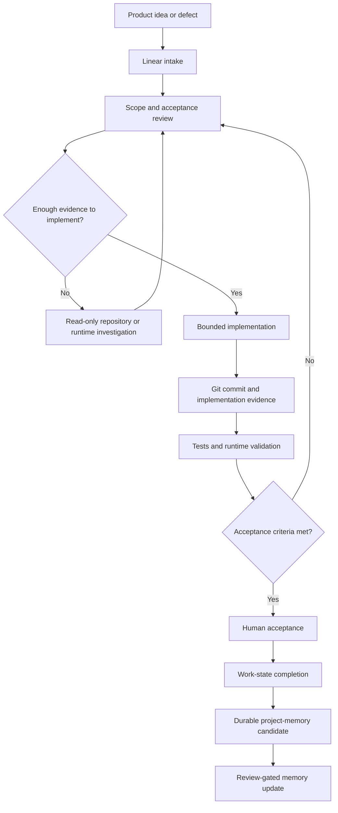

# GlassBox Development Workflow — Evidence-Driven Delivery Case Study

This repository describes the working model I use to turn product ideas and defects into scoped, implemented, validated, and reviewable outcomes.

> **The workflow shows how I use AI tools without outsourcing product judgment, privacy decisions, runtime acceptance, or final responsibility.**

## At a glance

| Area | Approach |
| --- | --- |
| Active product work | Linear |
| Version and implementation evidence | GitHub |
| Investigation and implementation support | ChatGPT and Codex |
| Durable project memory | Obsidian-based Brainflow |
| Workflow automation | n8n and OpenAI API |
| Final authority | Human review and runtime acceptance |
| Private material | Product source, tickets, prompts, evidence details, and live configuration |

## What this proves

- I can separate product intent, implementation, evidence, validation, and long-term knowledge instead of treating them as one blurred activity.
- I work from accepted scope and observable evidence rather than allowing an AI agent to decide what is complete.
- I distinguish successful compilation from runtime acceptance.
- I preserve decisions and validated outcomes so future work does not depend only on chat history.
- I can design a multi-tool engineering workflow with explicit ownership and safety boundaries.

## Why the workflow exists

Independent development can become difficult to control when ideas, tickets, code changes, AI conversations, test results, and historical notes all compete to be the source of truth.

This workflow assigns each system one primary responsibility. That makes it possible to answer four questions clearly:

1. What work was accepted?
2. What was actually changed?
3. What evidence shows the result works?
4. What knowledge should remain available after the work is closed?

## Workflow

## Responsibility model

| System or role | Primary responsibility |
| --- | --- |
| **ChatGPT** | Product orchestration, ticket shaping, specification support, scope review, and final cross-system review. |
| **Codex** | Repository investigation, bounded implementation, debugging, targeted validation, and structured closing evidence. |
| **Linear** | Accepted GlassBox scope, acceptance criteria, work state, and review state. |
| **GitHub** | Repository state, commits, pull requests, and implementation evidence. |
| **Brainflow** | Reviewed durable decisions, release context, validation summaries, and historical project memory. |
| **n8n** | Deterministic collection, normalization, candidate preparation, and workflow coordination. |
| **OpenAI API** | Optional bounded structured-text processing inside explicit contracts. |
| **Human reviewer** | Product authority, privacy review, publication approval, and runtime acceptance. |

## Status discipline

- **Intake** means an idea or report exists; it does not authorize implementation.
- **Backlog** means future work has been shaped but is not active.
- **In Progress** means investigation or implementation is active.
- **In Review** means evidence, validation, or a decision is still pending.
- **Done** means the accepted criteria and required evidence are complete.

The exact tracker configuration remains private; the public principle is that status describes evidence and decision state rather than optimism.

## Evidence discipline

A change can require several independent forms of proof:

- repository and diff review;
- targeted automated tests;
- debug and release builds;
- physical-device or real-runtime validation;
- manual acceptance for visual or behavioral work;
- explicit confirmation that protected systems and user data were not affected.

The evidence required depends on the risk and nature of the change. No single command is treated as universal proof.

## Visual evidence

Additional visuals can be added later without changing the case-study structure, including:

- a sanitized lifecycle example;
- a high-level workflow map;
- anonymized evidence and handoff examples;
- recruiter-friendly summaries of completed work.

No real GlassBox ticket, private source excerpt, internal prompt, or raw runtime evidence will be published.

## Public boundary

This repository is a conceptual engineering case study. It does not include:

- application source code or implementation details;
- real issue descriptions, comments, identifiers, or private roadmap material;
- internal Codex prompts or closing reports;
- live n8n exports, credentials, execution logs, or API payloads;
- Brainflow documents containing private product evidence;
- automatic authority to merge, publish, or mark work complete.

## Explore the case study

- [Workflow principles](docs/workflow-principles.md)
- [Source-of-truth model](docs/source-of-truth-model.md)
- [Ticket lifecycle](docs/ticket-lifecycle.md)
- [Validation and evidence](docs/validation-and-evidence.md)
- [AI tool responsibilities](docs/ai-tool-responsibilities.md)
- [Security and sanitization](docs/security-and-sanitization.md)
- [Diagram notes](diagrams/workflow-overview.md)
- [Changelog](CHANGELOG.md)

## Related work

- [Developer profile](https://github.com/Charles-drZ/Charles-drZ)
- [GlassBox product case study](https://github.com/Charles-drZ/glassbox-showcase)
- [Automation workflow case study](https://github.com/Charles-drZ/automation-workflow-showcase)
- [Raspberry Home case study](https://github.com/Charles-drZ/raspberry-home-showcase)

This is a public portfolio case study, not a live operations manual.
