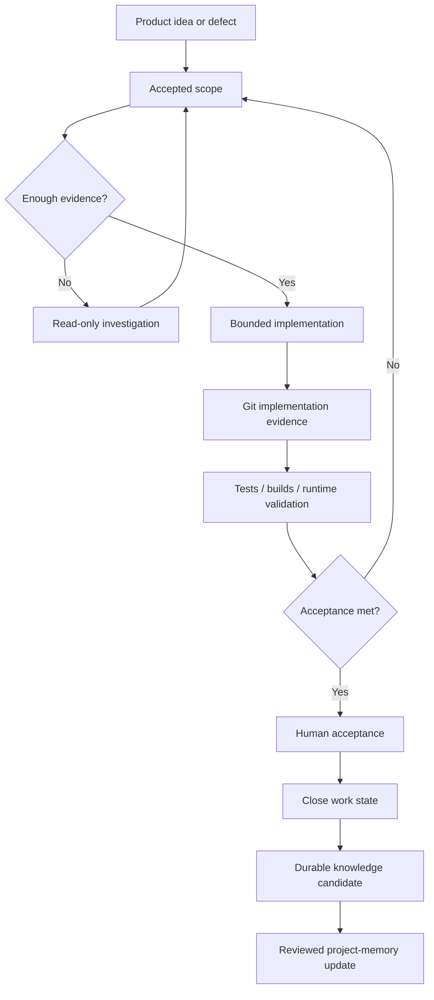

[← Developer profile](https://github.com/Charles-drZ)

# GlassBox Engineering Delivery System

**A case study in keeping product intent, implementation, validation, and durable engineering knowledge aligned.**

This is the working model around GlassBox development. It is not the product itself and it is not an attempt to automate engineering judgment.

Its purpose is practical: when product work spans issues, source code, AI-assisted investigation, test evidence, physical-device validation, release work, and long-lived documentation, each system needs a clear responsibility.

## The problem it solves

Long-running solo development becomes fragile when the same fact exists in several places with different meanings.

A ticket can say a feature is done while the runtime is still broken. A successful build can exist without physical-device acceptance. A chat can contain an important decision that never reaches durable project documentation. An automated summary can sound confident while missing source evidence.

The workflow therefore separates four questions:

1. **What work was accepted?**
2. **What was actually implemented?**
3. **What evidence shows the result works?**
4. **What knowledge should remain durable after the work is closed?**

## Responsibility model

**Linear** owns accepted product scope, acceptance criteria, and active work state.

**GitHub** owns repository state, commits, pull requests, and implementation evidence.

**Codex** supports bounded repository investigation, implementation, debugging, and targeted validation.

**ChatGPT** supports product orchestration, specification work, review, and cross-system reasoning.

**Brainflow** stores reviewed durable decisions, release context, validation summaries, and long-term project knowledge.

**n8n** handles deterministic collection, normalization, candidate preparation, and workflow coordination.

**Human review** remains the authority for product meaning, privacy, publication, risky operations, and final runtime acceptance.

No tool is allowed to silently become the source of truth for responsibilities owned by another system.

## Delivery loop

This loop is intentionally risk-sensitive. A documentation change, a SwiftUI interaction, a CloudKit restore path, and an infrastructure mutation do not require identical proof.

## Evidence model

Depending on the change, completion evidence can include:

- repository and diff review;
- targeted automated tests;
- debug or release builds;
- physical-device validation;
- real-runtime smoke checks;
- persistence/restore/reinstall checks;
- rollback or recovery proof;
- explicit visual or behavioral acceptance.

The important rule is that **evidence matches the claim**. A compile proves compilation. It does not automatically prove a user flow, synchronization path, production deployment, or visual result.

## Brainflow — durable engineering knowledge

Brainflow is the private project-memory layer around GlassBox. It keeps reviewed decisions and validated outcomes available beyond individual chats or issue lifecycles.

It contains durable product and engineering context such as:

- accepted product decisions;
- release and TestFlight context;
- validation summaries;
- architecture/workflow decisions;
- historical project state;
- links between implementation evidence and longer-lived knowledge.

A deterministic Brain Atlas export helps visualize relationships across this knowledge system.

  

Information does not become durable memory merely because an AI generated it. Source, meaning, and validation state are reviewed first.

## Status discipline

Workflow state describes evidence and decision state rather than optimism:

- **Intake** — an idea or report exists;
- **Backlog** — future work is shaped but inactive;
- **In Progress** — investigation or implementation is active;
- **In Review** — evidence, validation, or a decision is pending;
- **Done** — accepted criteria and required evidence are complete.

The exact tracker configuration remains private; the transferable idea is that status should communicate what is actually known.

## Engineering principles

### Explicit authority

Each system owns a bounded kind of truth. This reduces accidental drift between tickets, source, runtime behavior, and documentation.

### Deterministic before semantic

Where data can be collected, normalized, keyed, compared, or validated deterministically, that happens before model-assisted interpretation.

### Runtime matters

Physical devices and real services remain authoritative for behavior that only exists at runtime.

### Recovery is part of delivery

Infrastructure and persistence changes are planned with rollback, restore, or safe failure paths rather than treating recovery as an afterthought.

### Durable knowledge is reviewed

Chat history is useful working context, not permanent project truth. Only reviewed outcomes and decisions are promoted into long-lived project memory.

## What this demonstrates

This system is supporting evidence for the product and infrastructure work elsewhere in the portfolio. It demonstrates:

- engineering orchestration across multiple tools;
- source-of-truth design;
- risk-sensitive validation;
- explicit human/automation authority boundaries;
- long-lived technical documentation;
- deterministic evidence handling;
- a development process that remains inspectable even when AI tools participate in implementation.

## Public boundary

The repository does not publish GlassBox source, real issue bodies, private prompts, raw runtime evidence, live n8n exports, credentials, internal Brainflow documents, or private roadmap material.

Public diagrams and explanations describe responsibilities and engineering principles rather than exposing deployable internal systems.

## Explore

- [Workflow principles](docs/workflow-principles.md)
- [Source-of-truth model](docs/source-of-truth-model.md)
- [Ticket lifecycle](docs/ticket-lifecycle.md)
- [Validation and evidence](docs/validation-and-evidence.md)
- [AI tool responsibilities](docs/ai-tool-responsibilities.md)
- [Security and sanitization](docs/security-and-sanitization.md)
- [Diagram notes](diagrams/workflow-overview.md)
- [Changelog](CHANGELOG.md)

## Related work

- [Developer profile](https://github.com/Charles-drZ)
- [GlassBox](https://github.com/Charles-drZ/glassbox-showcase)
- [NodeMedic](https://github.com/Charles-drZ/nodemedic-showcase)
- [Raspberry Home](https://github.com/Charles-drZ/raspberry-home-showcase)
- [Automation workflow](https://github.com/Charles-drZ/automation-workflow-showcase)
