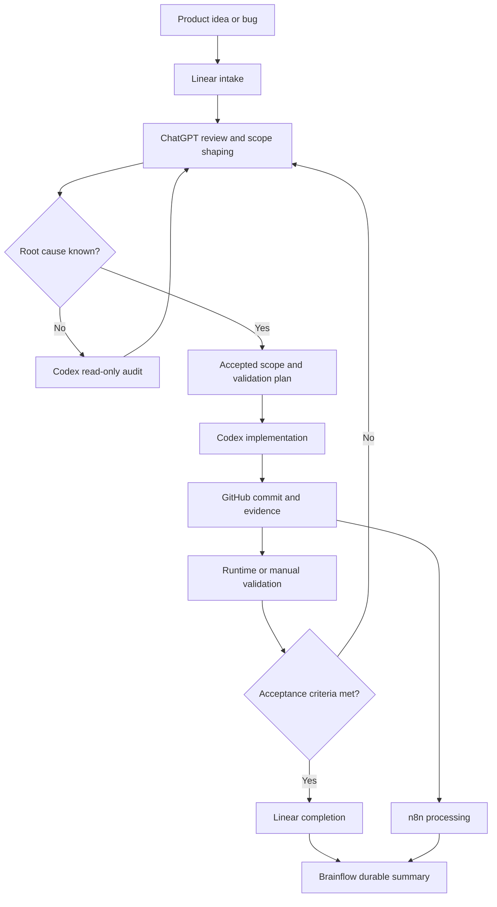

# GlassBox Development Workflow — Public Case Study

This repository describes the development workflow used for controlled, traceable independent product work.

It matters because it shows how scope, implementation evidence, validation, and long-term project knowledge can work together without treating AI assistance as autonomous.

## Why this workflow exists

Independent development benefits from explicit boundaries. Product ideas, accepted scope, committed implementation, historical context, automation, and release acceptance should not be treated as the same thing.

The workflow separates those responsibilities so that work can be scoped, reviewed, validated, and documented without presenting AI assistance as autonomous.

## Responsibilities

| System or role | Primary responsibility |
| --- | --- |
| ChatGPT | Orchestration, ticket shaping, specification support, product and scope review. |
| Codex | Repository audit, implementation, debugging, targeted validation, and structured closing reports. |
| Linear | Active work, accepted scope, acceptance criteria, issue status, and review state. |
| GitHub | Version history, implementation evidence, commits, and repository state. |
| Obsidian Brainflow | Durable project memory, decisions, release notes, runtime-evidence summaries, and historical context. |
| n8n | Synchronization, digest generation, workflow automation, and context processing. |
| OpenAI API | Optional structured text processing, summary generation, and automation support. |
| Human reviewer | Final decision authority, product decisions, privacy review, publication approval, and runtime acceptance. |

## Workflow overview

## Status discipline

- **Todo / Intake** — a raw idea or report; it does not authorize implementation.
- **Backlog** — shaped future work.
- **In Progress** — active audit or implementation.
- **In Review** — validation or review is still pending.
- **Done** — acceptance criteria and required evidence are complete.

## Further reading

- [Workflow principles](docs/workflow-principles.md)
- [Source-of-truth model](docs/source-of-truth-model.md)
- [Ticket lifecycle](docs/ticket-lifecycle.md)
- [Validation and evidence](docs/validation-and-evidence.md)
- [AI tool responsibilities](docs/ai-tool-responsibilities.md)
- [Security and sanitization](docs/security-and-sanitization.md)
- [Diagram notes](diagrams/workflow-overview.md)
- [Changelog](CHANGELOG.md)

## Related repositories

- [Public developer profile](https://github.com/Charles-drZ/Charles-drZ)
- [GlassBox product case study](https://github.com/Charles-drZ/glassbox-showcase)
- [Automation workflow case study](https://github.com/Charles-drZ/automation-workflow-showcase)
- [Raspberry Home documentation case study](https://github.com/Charles-drZ/raspberry-home-showcase)

This is a public portfolio case study, not a live operations manual.
