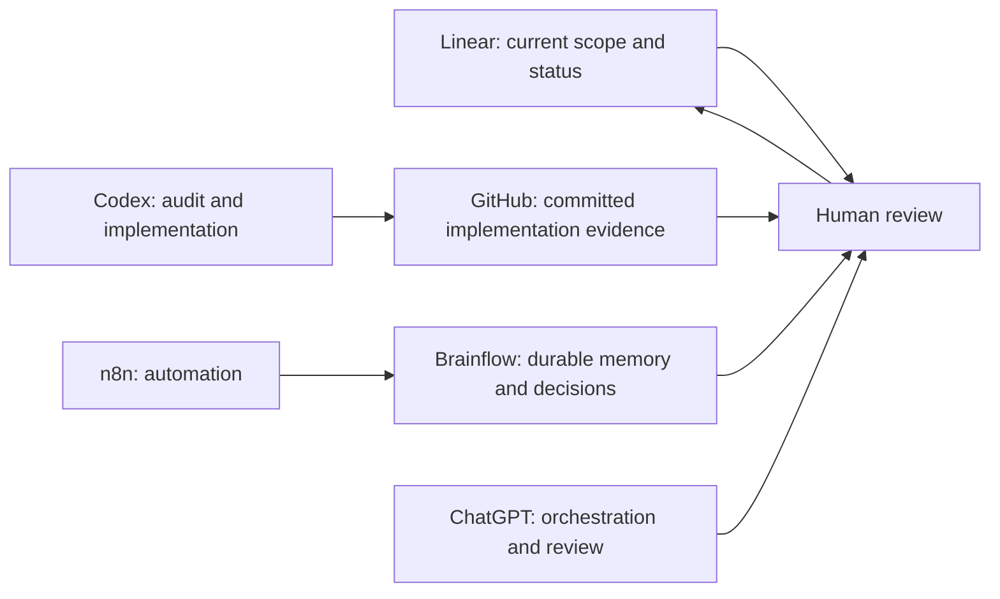

# Source-of-truth model

No single tool is the answer to every project question. The workflow assigns each system a purpose so information stays reviewable and does not drift.

| Source | What it answers |
| --- | --- |
| Linear | What is currently accepted, in scope, and under review? |
| GitHub | What was committed and when? |
| Brainflow | What durable decisions, summaries, and historical context matter? |
| ChatGPT | How should an idea be shaped, reviewed, or evaluated? |
| Codex | What did a bounded audit or implementation find and validate? |
| n8n | How can selected information be processed and prepared consistently? |
| Human | What is approved for implementation, release, privacy, and publication? |

The model is intentionally human-controlled. Tool outputs assist decisions; they do not silently replace them.
